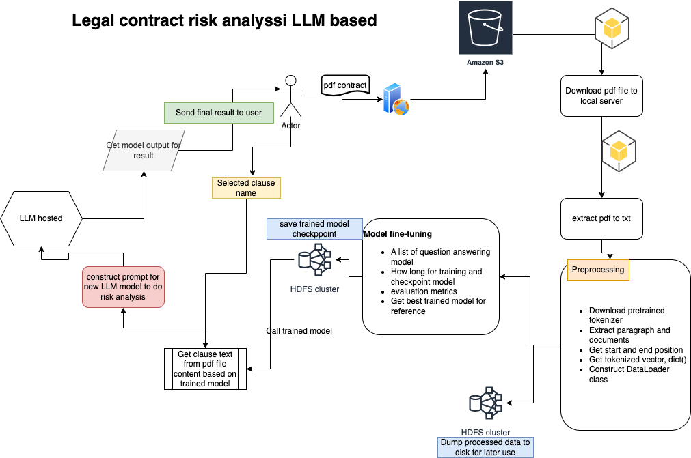

##  Leveraging Pre-Trained Transformers for Legal Contract Analysis: From PDF to Risk Assessment

### Description:

In the realm of legal contract analysis, the integration of cutting-edge natural language processing (NLP) techniques has revolutionized the traditional methodologies. Harnessing the power of pre-trained models based on transformers, this innovative approach streamlines the process from document ingestion to comprehensive risk assessment, offering unprecedented efficiency and accuracy.

### Diagram:

### Background

Build a legal contract analysis system that will analyze for one clause based on full previous legal contracts for the similiar clause, the reason is that this is a new area for the general LLM model, we will extract similiar clause from the full database of previous one, add some new information for the model.

### Steps Summary

1. Load new coming contract and get user provides question.
2. Split current contract based on paragraph for each clause.
3. Do pre-processing step like split, stop words remove, normalize to get the list of words
4. Load full historical contracts and do preprocessing step like new coming contract
5. Use embedding models to embed these list of words and save them into VectorDB.
6. Get similiar clause from VectorDB based on selected clause
7. Construct them into the clause prompt and sent it to LLM model
8. Wait for the LLM model to get the result and send result to user.
   

### Process step

The process commences with the ingestion of legal contracts in PDF format, leveraging specialized tools to seamlessly convert them into machine-readable text. This initial step ensures the accessibility of the document's content for subsequent analysis, eliminating the inherent limitations posed by the proprietary nature of PDF files.

Upon conversion to text, the pre-trained transformer model embarks on a meticulous extraction process, discerning and isolating relevant clauses from the corpus. Employing advanced linguistic features and contextual understanding, the model adeptly identifies key clauses, provisions, and contractual obligations embedded within the document, thereby laying the foundation for comprehensive analysis.

Subsequently, the extracted clauses are channeled into a new instance of a Language Model (LM), tailored specifically for risk assessment in legal contracts. This LM, primed with domain-specific knowledge and trained on vast repositories of legal texts, possesses the capability to discern nuanced legal nuances and implications inherent within contractual clauses.

Through a synergistic fusion of cutting-edge NLP techniques, the LM navigates through the extracted clauses, evaluating their implications within the context of pertinent legal frameworks and precedents. Leveraging probabilistic inference and semantic analysis, the model identifies potential risks, ambiguities, and contractual discrepancies, empowering legal practitioners with actionable insights to mitigate liabilities and safeguard their interests.

### Goodness

In essence, the integration of pre-trained transformers into the legal contract analysis paradigm represents a paradigm shift in the field, enabling expedited document processing, nuanced clause extraction, and sophisticated risk assessment. By amalgamating state-of-the-art technologies with domain-specific expertise, this transformative approach heralds a new era of efficiency and precision in legal contract analysis, fostering informed decision-making and risk mitigation strategies.

### Key parts to implement

- Background and limitation
  Legal person that need to get some clause risk analysis that meed much time and effort to analysis the contract.
  To use AI to help legal person to reduce effort and provide some insights
  Contract data shouldn't been sent out from the server side.
  Cluster create a virtual env that support one 24GB GPU
- Problem split
  1. How to get related clauses 
      -> Use QA model to extract related clause paragragh
         Tested that based on the QA model doesn't perform well to get the matched clauses, 
         Also couldn't handle long context
      -> Use vectorDB to use similiarity to get related paragphragh
         How to defined the start and end of the paragragh 
            -> Rule-based logic to extract the paragraghs
            -> Pre-processing: paragraph split, remove special words or empty or lines fewer than 30 words.
            -> Call vectorDB to store text
  2. How to analysis clause -> LLM based to provide rich insights
  3. How to help legaler -> output of related analysis result to user for guide
- Solution explored
  Solution 1: use QA model to extract related clause, call model prediction to constract the prompt to the LLM 
  Solution 2: use VectorDB to query similar paragraghs and return top1 text to constract the prompt to the LLM 
  So for both solution is to use Local LLM model to do analysis
- Model selection
  - Qa model: 
    - Based on transformers pre-trained model like BERT, BART, RoBERT
    - Fine-tuned model based on open-source QA dataset CUAD
      - Direct fine-tuned full model
      - Use LORA to tune added parameters
    - Which fine-tuned model is better? based on test that with LORA rank=8 get smallest error
    - How about to use model in real contract? -> Not good, only get subpass, or not correct result.
  - Vectordb:
    - Pre-processing text, get paragraphs list and send them to DB
    - Use provide the key clause to analysis, then construct the query key text
    - Based on vectorDB to get related paragraghs.
  - Both of these solutions has limitation: 
    - What if get the related paragraphs is not the correct one?
- Implement steps:
  - Vectordb based
    - User upload one pdf file from frontend, user select one clause to analysis
    - The pdf file will be sent to backend, convert to text and split into paragraghs, send them to vectorDB, provide one index based on the pdf file name
    - Keep in mind that this will only process one pdf, no need to store full historical pdf files content.
    - When user to do the query, only provide the clause name to analyze
      - Backend will first get similar clause text based on the pre-defined dictionary for the clause name
      - Construct the query text based on user clause and similar clause words, construct with & to seperate them
      - Use the query text to vectorDB to get similar clause?
      - How to add more confident to the user query and content related clauses?  
        - Add more similar clause key words -->> this solution is tested.
        - Construct different query, like re-order the word order and get multiple result, then combine the result into list, then get the more related result based on the scores.
    - Get the vectorDb result, then construct the query query to the prompt, send it to the LLM model, and get the model output
  - Qa model based: [**Detail training code for QA**](./contract_training.py) 
    - Get open-sourced QA dataset and re-construct the query for model use-case: question, content, ids, answers
    - Get pre-trained model and tokenizer, construt the pre-processing func and post-processing func
    - Solve long context problem that use tokenizer to truncation only_second logic, then will return multiple training dataset, will create the answer start and end position based on the truncation context, maybe the answer is in the context or out of the context, then just with start and end with first word id.
    - After get full pairs: question, answering into tokenizer, will get the inputs of the model with input_ids, mask, start_positions, end_positions, this is the dataset to use.
    - Build the trainer object to fine-tuning the model with `full parameters` changed or use `LORA` to fine-tuning
    - Result: both models get trained with loss decreased, the training takes about 4 or 5 hours in one GPU, the processing takes half a day, but the processed dataset is stored to disk for later use, model checkpoint is stored for each epoch, for each model will be stored in different folder.
- Result from bizz
  As current problem is not a supervised problem, there isn't a metric that could be used to evaluate our result.
  But legal provide 102 contracts, and have provided the related claused for each one potential risk, and summmary them into excel for users to provides useful or not to evaluate our model.
- Improvement 
  - How to better select related clauses paragraphs? not just rule-based
  - Which models that should be used to do analysis?
  - 
- Todo: 
  - Clause list: 41 clauses support.
  - Contract list: 20 contracts.
  - Model output result
  - Score the result from bizz

